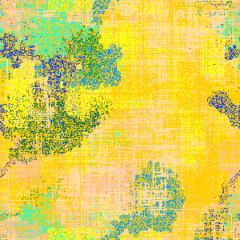
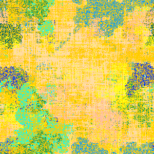
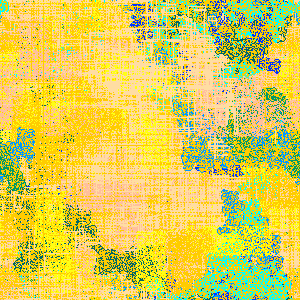

# PixelBot v1

[online demo](https://jniac.github.io/e-artsup/misc/Pixel-Bot/v1/)







# serveur local
La page index.html nécessite l'existence d'un serveur local pour télécharger les resources locales (`PixelBot.load(url)`).  
Il existe plein de solutions pour servir des fichiers locaux en http. Je propose une solution NodeJS :

- installer [node & npm](https://nodejs.org/en/) (prendre la version la plus avancée, et suivre les instructions de l'installateur)
- installer (globalement) `super-quick-static`:
```shell
$ npm install -g super-quick-static
```
- lancer un serveur local :
```shell
$ npm super-quick-static
```
voilà !

[http://localhost:8000](http://localhost:8000)

# Getting Started

[zip/PixelBot-Starter.zip](zip/PixelBot-Starter.zip?raw=true)

exemple #1 : [la fourmi de Langton](https://www.youtube.com/watch?v=qZRYGxF6D3w)

```javascript
class LangtonAnt extends PixelBot {

    start() {

        this.x = 150
        this.y = 150
        this.color1 = '#fc0'
        this.color2 = '#0cf'

    }

    update() {

        if (this.pixelColor.r < .5) {

            this.turnLeft()
            this.setPixelColor(this.color1)

        } else {

            this.turnRight()
            this.setPixelColor(this.color2)

        }

        this.move()

    }

}

new LangtonAnt()
new LangtonAnt().set({
    x: 100,
    y: 200,
})
```

exemple #2: Simple Cloner

```javascript
//
let DN = max => Math.ceil(Math.random() * max)

let colors = ['green', 'grey', 'pink']

let getRandomColor = () => colors[Math.floor(Math.random() * colors.length)]

class Cloner extends PixelBot {

    start() {

        this.color = 'red'

    }

    update() {

        // ici mettre un code pour que en moyenne le bot peigne 2 fois sur 3 seulement
        if (DN(3) !== 1) {

            this.setPixelColor(this.color)

        }

        // ici une chance sur 30 que le bot génère un nouveau bot
        if (DN(30) === 1) {

            let child = new Cloner().set({

                x: this.x,
                y: this.y,
                angle: this.angle,
                color: getRandomColor(),
                lifeMax: 10 + DN(10),

            })

            child.turnLeft()

        }

        this.move()

        // ici, et c'est déjà fait, un test aléatoire pour faire tourner le bot
        if (DN(100) == 1) {

            this.turnLeft()

        }

    }

}

new Cloner()
```


exemple #3: RectPainter
```javascript
class RectPainter extends PixelBot {

    start() {

        this.color = '#ec4332'
        this.width = 10
        this.height = 5
        this.x = 150
        this.y = 150
        this.paintChance = 5 / 5

        this.countX = 0
        this.countY = 0

    }

    update() {

        if (this.countX < this.width) {

            this.move()
            this.countX++

        } else {

            if (this.countY % 2 == 0) {

                this.turnRight()
                this.move()
                this.turnRight()

            } else {

                this.turnLeft()
                this.move()
                this.turnLeft()

            }

            this.countX = 1
            this.countY++

        }

        if (this.countY === this.height) {

            this.destroy()

        } else {

            if (Math.random() < this.paintChance) {

                this.setPixelColor(this.color)

            }

        }

    }

}
```
