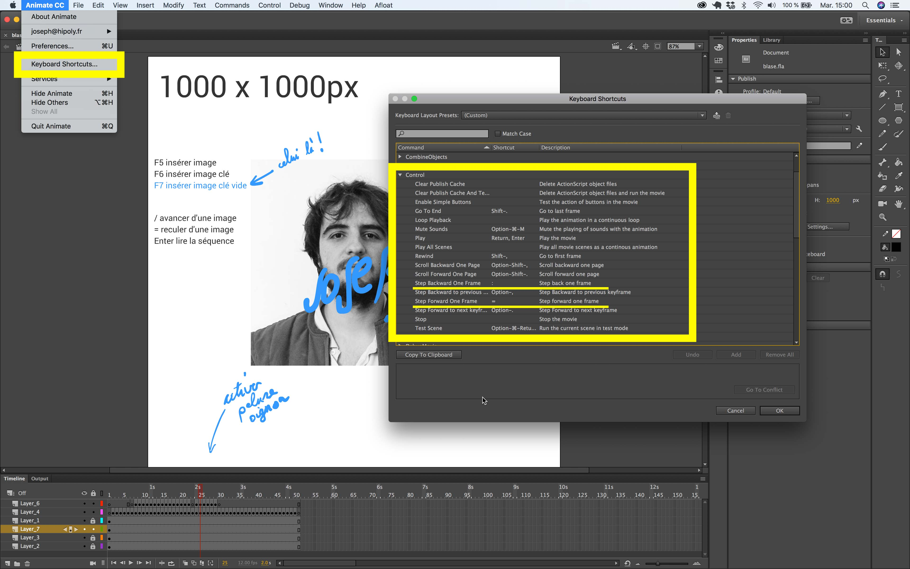

# affiche ton blase !

fichier démo:
[blase.fla](https://github.com/jniac/e-artsup/blob/master/motion/animate/superportrait/blase/blase.fla?raw=true)

## Animate:

Le projet :
- ActionScript 3.0 (bien qu'on s'en cogne en vrai)
- format document 1000 x 1000 px
- format portrait 500 x 500 px (250px de marges tournantes)
- 12 fps

La technique :  

Animer image par image veut dire lâcher le pad ou la souris pour prendre un stylet. Pour naviguer dans le projet il va être **indispensable** d'utiliser le clavier. Les actions importantes sont :
- **F5** insérer une image (normale, c'est à dire prolonger une image d'une "frame")
- **F6** insérer une image-clé (en dupliquant la clé précédente)
- **F7** insérer une image-clé **vide** (vide ! ça veut dire devoir tout redessiner à chaque nouvelle frame... et oui !)
- **/** (macOS) reculer d'une image (à configurer, voir ci dessous)
- **+** (macOS) avancer d'une image (à configurer, voir ci dessous)
- **Enter** jouer (ou arrêter) la séquence

  

rappel configuration de l'interface :
régler [/] [+] comme commandes pour reculer / avancer d'une image :

  

## Media Encoder

Dans Media Encoder choisir le format WebM (codec à installer, voire plus bas).  
Dans les paramètres vidéo, penser à activer l'encodage de la couche Alpha (transparence).  

Couche Alpha :

---

  

note:
### plugin Adobe Media Encoder
Pour pouvoir encoder en [WebM (format open source Chrome Opera Firefox)](https://fr.wikipedia.org/wiki/WebM)  
http://www.fnordware.com/WebM/    

Pourquoi utiliser le format WebM ? C'est le seul format compressé qui encode le canal alpha (rgba, *a* pour alpha : transparence). Par ailleurs les codecs (vp8 et vp9) sont libres de droit, et les performances sont très proches du fameux H.264.

Fun fact :  
Le seul format qui encodait aussi le canal alpha est le **[flv](https://fr.wikipedia.org/wiki/Flash_Video)** (qui n'est guère plus supporté par les navigateurs aujourd'hui). FLV stands for... Flash Video ! Et cela date de l'époque où Adobe dominait le web avec Flash, avant que Google & Apple ne viennent réclamer leur part du cool en rendant obsolète le player flash (Google en promouvant l'HTML5 à coup de site de propagandes et d'expériences sponsorisés, Apple en refusant l'exécution du player Flash sur ses premiers iPhones).

### Atom.io video preview
https://atom.io/packages/videoplayer  
Installer le package sous Atom :
- Settings: `cmd/ctrl + ,`
- **+ Install**
- search : _videoplayer_ + install
